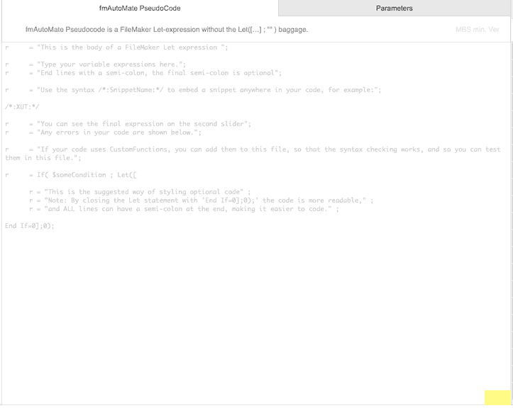

# Write your own fmAutoMations

It is quite simple to write your own fmAutoMate menu commands.

The 'psuedo-code' that fmAutoMate uses is nothing more than a FileMaker the innards of a FileMaker let statement, so if you have ever used a FileMaker Let statement you are good to go!

(Actually, there is a little more, fmAutoMate also offers code blocks, placeholders which represent frequently used snippets of code.) 

## Hello World Example

Here is how to make a good old traditional Hello World command:

Open fmAutoMate

Press the [-> Open fmAutoMate] button to open the editing view

Press [New] to create a new Menu Item

Change the name of the Menu Item to `Hello World`

Press `[View]` (or the edit button on the left) to open the fmAutoMate editor



Type the following code into the editor

```
vMessage = "Hello World";
```

Then choose `(*:DIALOG vMessage:*)` from the code blocks on the right:


(Just click the `[<-]` to add the placeholder.)


You should now have

```
vMessage = "Hello World";
(*:DIALOG vMessage:*)
```

At the bottom right of the field you should see a thumbs up icon 👍 indicating that your code is correct. (If not see [troubleshooting](#troubleshooting) below)

Press the `[fmAutoMate]` button to install your new menu item.

Press the `[Edit Test Script]` button to open the test script in the FileMaker Script Workspace.

Right click on a script step to show the fmAutoMate context menu.

Select `My Stuff > Examples > Hello World`

You should get a dialog saying Hello World 😀


(Note: The icon may look different in your FileMaker)


## Troubleshooting

If you have a syntax error in your code - if you forgot the semi colon - you'll get a red warning.


 In this case, you can

- check your code visually and correct your code by hand
- click the `[!!]` button to see fmAutoMate's Let statement
- use the `[Check Syntax]` button and follow the instructions to check your code in the FileMaker calculation editor.


## Next steps

If you are interested to see the Let statement that fmAutoMate generates

- just click the `[👍]` button
- or - when you have a syntax error - the  `[‼️]` button

## Add a short description for the help menu

Type `Shows a Hello dialog` in the description field

## Move your menu item to a submenu

You will most likely want to make your own submenu and put your stuff in it. This is as easy as just adding a menu name:

In the Menu field change the Menu name to `My Stuff > Examples` to put your Hello World item in the `Examples` submenu of your `My Stuff` Menu

Select `My Stuff > Examples > Hello World`

